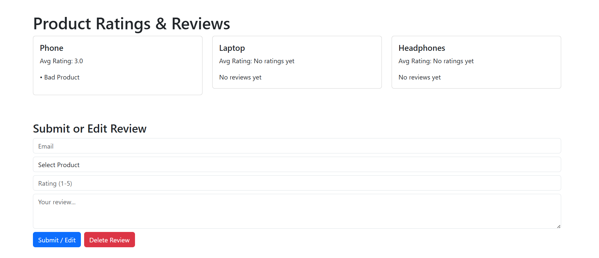

# ⭐ Ratings & Review System

A full-stack web app for managing product reviews — users can add, edit, and delete reviews with live average ratings shown for each product.

---

## 🔧 Tech Stack

- **Frontend**: React, Bootstrap
- **Backend**: Node.js, Express
- **Database**: MySQL

<p align="center">
  
</p>

---

## ✨ Features

- ✅ View all products and their average ratings.
- 📝 Submit, edit, or delete reviews using email.
- 📊 Real-time product summary with average rating and recent reviews.
- 🔄 Instant frontend updates on review submission.

---

## 🗃️ Database Setup

```sql
CREATE DATABASE IF NOT EXISTS ratings_db;
USE ratings_db;

CREATE TABLE users (
  id INT AUTO_INCREMENT PRIMARY KEY,
  email VARCHAR(255) UNIQUE NOT NULL
);

CREATE TABLE products (
  id INT AUTO_INCREMENT PRIMARY KEY,
  name VARCHAR(255) NOT NULL
);

CREATE TABLE reviews (
  id INT AUTO_INCREMENT PRIMARY KEY,
  user_id INT NOT NULL,
  product_id INT NOT NULL,
  rating INT CHECK (rating BETWEEN 1 AND 5),
  review_text TEXT,
  created_at TIMESTAMP DEFAULT CURRENT_TIMESTAMP,
  updated_at TIMESTAMP DEFAULT CURRENT_TIMESTAMP ON UPDATE CURRENT_TIMESTAMP,
  UNIQUE KEY unique_review (user_id, product_id),
  FOREIGN KEY (user_id) REFERENCES users(id) ON DELETE CASCADE,
  FOREIGN KEY (product_id) REFERENCES products(id) ON DELETE CASCADE
);

INSERT INTO products (name) VALUES
('Phone'), ('Laptop'), ('Headphones');
```

---

## 🖥️ Backend

### `db.js`

```js
const mysql = require('mysql2');

const db = mysql.createConnection({
  host: 'localhost',
  user: 'root',
  password: 'root',
  database: 'ratings_db'
});

db.connect((err) => {
  if (err) {
    console.error('Database connection failed:', err.stack);
    return;
  }
  console.log('Connected to MySQL database!');
});

module.exports = db;
```

---

### `server.js`

```js
const express = require('express');
const cors = require('cors');
const bodyParser = require('body-parser');
const db = require('./db');

const app = express();
app.use(cors());
app.use(bodyParser.json());

app.get('/', (req, res) => {
  res.send('Ratings and Review API is running!');
});

// GET products
app.get('/api/products', (req, res) => {
  db.query('SELECT * FROM products', (err, results) => {
    if (err) return res.status(500).json({ error: 'Database error' });
    res.json(results);
  });
});

// POST or update review
app.post('/api/reviews', (req, res) => {
  const { email, product_id, rating, review_text } = req.body;
  if (!email || !product_id) return res.status(400).json({ error: 'Email and product are required' });

  db.query('INSERT IGNORE INTO users (email) VALUES (?)', [email], (err) => {
    if (err) return res.status(500).json({ error: 'Failed to insert user' });

    db.query('SELECT id FROM users WHERE email = ?', [email], (err, results) => {
      if (err || results.length === 0) return res.status(500).json({ error: 'User lookup failed' });
      const user_id = results[0].id;

      const query = `INSERT INTO reviews (user_id, product_id, rating, review_text)
                     VALUES (?, ?, ?, ?)
                     ON DUPLICATE KEY UPDATE rating = ?, review_text = ?`;
      const values = [user_id, product_id, rating || null, review_text || null, rating || null, review_text || null];

      db.query(query, values, (err) => {
        if (err) return res.status(500).json({ error: 'Review submit failed' });
        res.json({ message: 'Review submitted or updated!' });
      });
    });
  });
});

// DELETE review
app.delete('/api/reviews', (req, res) => {
  const { email, product_id } = req.body;
  if (!email || !product_id) return res.status(400).json({ error: 'Email and product required' });

  db.query('SELECT id FROM users WHERE email = ?', [email], (err, results) => {
    if (err || results.length === 0) return res.status(404).json({ error: 'User not found' });
    const user_id = results[0].id;

    db.query('DELETE FROM reviews WHERE user_id = ? AND product_id = ?', [user_id, product_id], (err, result) => {
      if (err) return res.status(500).json({ error: 'Delete failed' });
      if (result.affectedRows === 0) return res.status(404).json({ error: 'No review found to delete' });
      res.json({ message: 'Review deleted successfully' });
    });
  });
});

// GET summary
app.get('/api/product-summary', (req, res) => {
  const query = `
    SELECT p.id AS product_id, p.name AS product_name,
           ROUND(AVG(r.rating), 1) AS average_rating,
           GROUP_CONCAT(r.review_text SEPARATOR ' ||| ') AS reviews
    FROM products p
    LEFT JOIN reviews r ON p.id = r.product_id
    GROUP BY p.id
  `;
  db.query(query, (err, results) => {
    if (err) return res.status(500).json({ error: 'Failed to fetch summary' });
    res.json(results);
  });
});

app.listen(5000, () => {
  console.log('Server running on port 5000');
});
```

---

## 🎨 Frontend (`App.js`)

```js
import React, { useEffect, useState } from 'react';
import 'bootstrap/dist/css/bootstrap.min.css';

function App() {
  const [products, setProducts] = useState([]);
  const [summary, setSummary] = useState([]);
  const [form, setForm] = useState({
    email: '',
    product_id: '',
    rating: '',
    review_text: ''
  });
  const [message, setMessage] = useState('');

  useEffect(() => {
    fetch('http://localhost:5000/api/products').then(res => res.json()).then(setProducts);
    fetch('http://localhost:5000/api/product-summary').then(res => res.json()).then(setSummary);
  }, []);

  const handleChange = (e) => {
    setForm({ ...form, [e.target.id]: e.target.value });
  };

  const handleSubmit = async (e) => {
    e.preventDefault();
    const res = await fetch('http://localhost:5000/api/reviews', {
      method: 'POST',
      headers: { 'Content-Type': 'application/json' },
      body: JSON.stringify(form),
    });
    const data = await res.json();
    setMessage(data.message || data.error);
    if (data.message) setTimeout(() => window.location.reload(), 1000);
  };

  const handleDelete = async () => {
    const res = await fetch('http://localhost:5000/api/reviews', {
      method: 'DELETE',
      headers: { 'Content-Type': 'application/json' },
      body: JSON.stringify({ email: form.email, product_id: form.product_id })
    });
    const data = await res.json();
    setMessage(data.message || data.error);
    if (data.message) setTimeout(() => window.location.reload(), 1000);
  };

  return (
    <div className="container mt-5">
      <h1>Product Ratings & Reviews</h1>
      <div className="row">
        {summary.map(p => (
          <div className="col-md-4 mb-3" key={p.product_id}>
            <div className="card p-3">
              <h5>{p.product_name}</h5>
              <p>Avg Rating: {p.average_rating || 'No ratings yet'}</p>
              <div>{p.reviews ? p.reviews.split(' ||| ').map((r, i) => <p key={i}>• {r}</p>) : 'No reviews yet'}</div>
            </div>
          </div>
        ))}
      </div>

      <h3 className="mt-5">Submit or Edit Review</h3>
      <form onSubmit={handleSubmit}>
        <input id="email" placeholder="Email" value={form.email} onChange={handleChange} className="form-control mb-2" required />
        <select id="product_id" value={form.product_id} onChange={handleChange} className="form-control mb-2" required>
          <option value="">Select Product</option>
          {products.map(p => <option key={p.id} value={p.id}>{p.name}</option>)}
        </select>
        <input id="rating" type="number" min="1" max="5" value={form.rating} onChange={handleChange} placeholder="Rating (1-5)" className="form-control mb-2" />
        <textarea id="review_text" value={form.review_text} onChange={handleChange} placeholder="Your review..." className="form-control mb-2" rows="3"></textarea>
        <button className="btn btn-primary me-2">Submit / Edit</button>
        <button type="button" className="btn btn-danger" onClick={handleDelete}>Delete Review</button>
      </form>

      {message && <div className="alert alert-info mt-3">{message}</div>}
    </div>
  );
}

export default App;
```

---

## 🚀 Run the Project

### ▶️ Backend

```bash
npm install
node server.js
```

### ▶️ Frontend

```bash
cd frontend
npm install
npm start
```

---

---

## 📸 Screenshot

### 🏠 Home Page – Product Summary



## 🙋‍♀️ Author

Made with 💙 by **Harshita Dutta**
